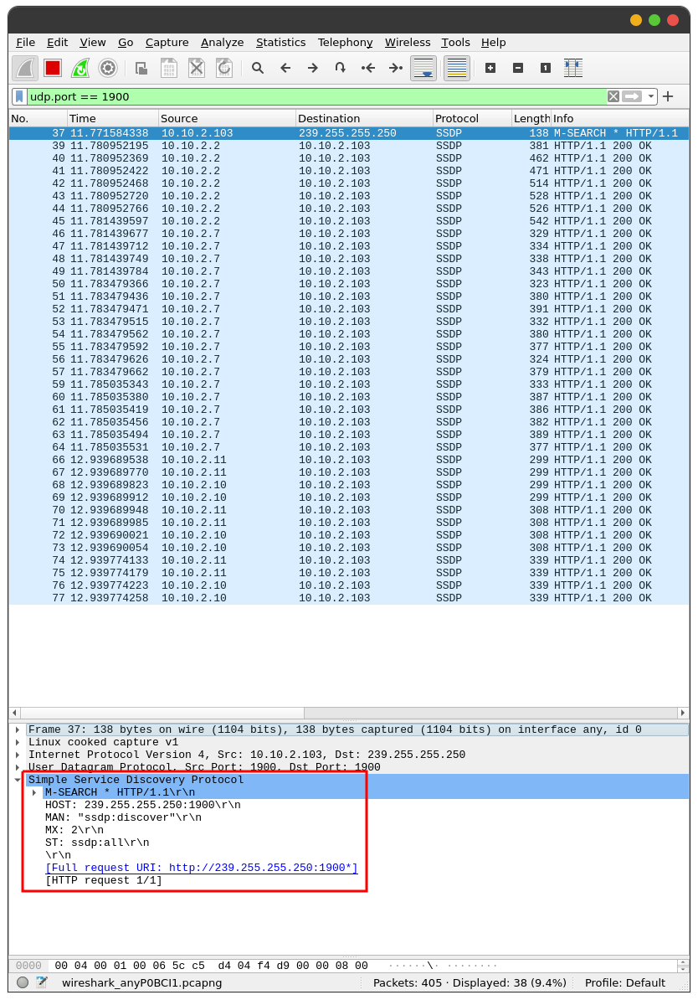

# KIV/PSI task 01 - IPv4 UDP Multicast client

This project shows a possible implementation of a simple multicast client that uses SSDP (Simple Service Discovery Protocol) to discover UPnP devices on a local network. https://en.wikipedia.org/wiki/Simple_Service_Discovery_Protocol

This application connects to the multicast group using the IP address of `239.255.255.250` and port `1900`. Then, it sends a discovery message which has the following format.

```
"M-SEARCH * HTTP/1.1\r\n"
"HOST: 239.255.255.250:1900\r\n"
"MAN: \"ssdp:discover\"\r\n"
"MX: 2\r\n"
"ST: ssdp:all\r\n\r\n";
```

Further explanation of this message can be found, for example, over at https://medium.com/@danny.jamesbuckley/ssdp-how-to-find-local-devices-a24f73ce4262. After sending off the discovery message, it keeps on waiting for devices to send their responses for a specified number of seconds.

## Build

### Requirements

In order to successfully compile the application, you're required to have `cmake` installed on your machine. Additionally, this application run on Linux only. To install `cmake` on a debian-based distribution, you can simply run the following command.

```bash
sudo apt-get install cmake
```

### Compilation

Once you have installed `cmake` on your machine, clone this project and navigate into the root folder of the project structure. Here, you're required to run the following sequence of commands.

```
mkdir build && cd build && cmake .. && make
```

Upon successful execution, a file called `kiv-psi-task01-silhavyj` should be created. This file represents the executable binary of the application.

### External libraries

As for external libraries used in the project, I took advantage of the `cxxopts` library which parses arguments from the command line https://github.com/jarro2783/cxxopts. This library is statically linked to the executable file.

## Execution

The application does not require any parameters to be passed in from the terminal. However, the user can change a few things in order to adjust the behavior of the application. First off, run the application like so.

```
./kiv-psi-task01-silhavyj --help
```

You will be prompted with a help menu that tells you all the options the application can be run with.

```
SSDP client (Sends out a discovery message and prints out responses)
Usage:
  ./kiv-psi-task01-silhavyj [OPTION...]

  -i, --inet arg     Interface the application will use to send and receive 
                     datagrams (default: 0.0.0.0)
  -t, --timeout arg  Number of seconds for which the application will be 
                     waiting for responses (default: 5)
  -h, --help         Prints help
```

### Examples

```
./kiv-psi-task01-silhavyj --inet 10.10.2.103 --timeout 10
./kiv-psi-task01-silhavyj -i 10.10.2.103 -t 10
```

### Setting up firewall rules

If you're not receiving any responses, it may be because your firewall is blocking them off. To fix this, you can temporarily turn the firewall off. However, this option is not recommended as it may result in security breach. A better way would be to temporarily add a new firewall rule allowing the packets to go through. The SSDP protocol is a UDP protocol that uses port 1900.

### Discovered devices

I tested the client within my home environment and as a result, I received over 30 responses from 4 different physical devices.

### Samples of responses from a Samsung TV

```
HTTP/1.1 200 OK
CACHE-CONTROL: max-age=1800
DATE: Fri, 02 Jan 1970 22:27:45 GMT
EXT: 
LOCATION: http://10.10.2.7:7676/rcr/
SERVER: SHP, UPnP/1.0, Samsung UPnP SDK/1.0
ST: urn:samsung.com:device:RemoteControlReceiver:1
USN: uuid:7bf2e75a-1286-4a99-af56-e7269dbb9150::urn:samsung.com:device:RemoteControlReceiver:1
Content-Length: 0


HTTP/1.1 200 OK
CACHE-CONTROL: max-age=1800
DATE: Fri, 02 Jan 1970 22:27:45 GMT
EXT: 
LOCATION: http://10.10.2.7:7677/MainTVServer2/
SERVER: SHP, UPnP/1.0, Samsung UPnP SDK/1.0
ST: urn:samsung.com:device:MainTVServer2:1
USN: uuid:c1fd12b2-d954-4dba-9e92-a697e1558fb4::urn:samsung.com:device:MainTVServer2:1
Content-Length: 0


HTTP/1.1 200 OK
CACHE-CONTROL: max-age=1800
DATE: Fri, 02 Jan 1970 22:27:45 GMT
EXT: 
LOCATION: http://10.10.2.7:7676/rcr/
SERVER: SHP, UPnP/1.0, Samsung UPnP SDK/1.0
ST: urn:samsung.com:service:MultiScreenService:1
USN: uuid:7bf2e75a-1286-4a99-af56-e7269dbb9150::urn:samsung.com:service:MultiScreenService:1
Content-Length: 0
```

### Responses captured by WireShark

